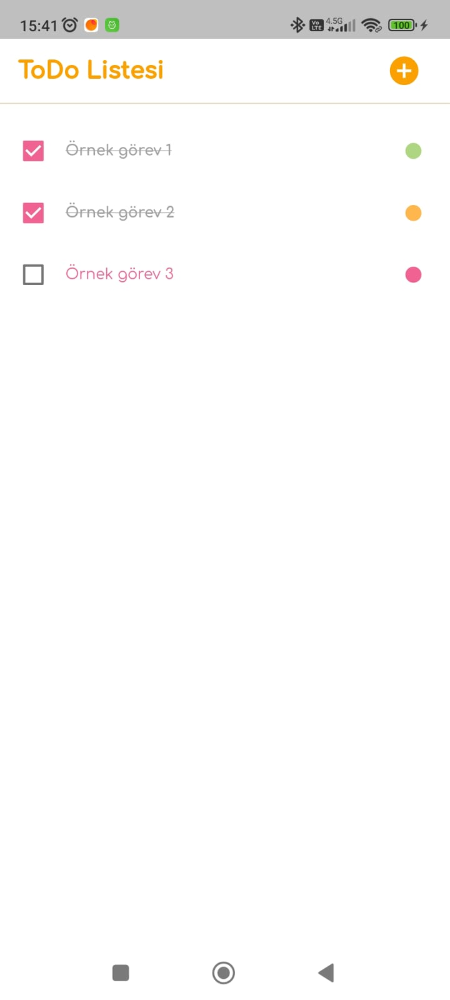
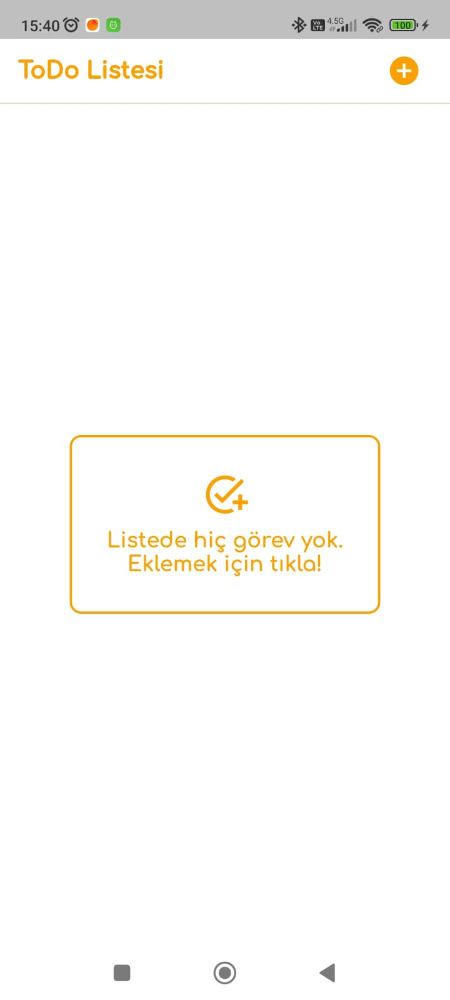
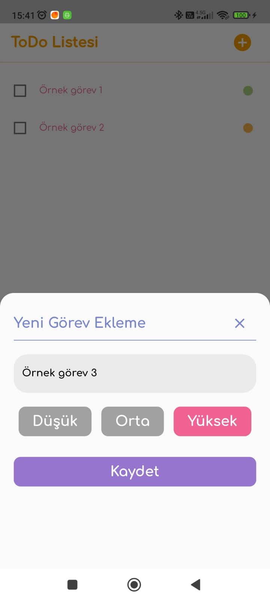
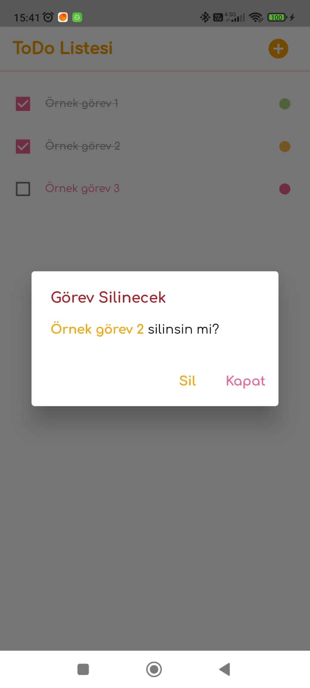

# ToDo Listesi Uygulaması

Bu proje, basit bir ToDo Listesi uygulamasıdır. Uygulamada görev ekleme, görev silme ve tamamlanan görevleri işaretleme özellikleri bulunmaktadır. StateManagement için Provider kütüphanesi kullanılmıştır.

## Ekran Görüntüleri

Aşağıda uygulamanın farklı ekranlarından bazı örnekler bulunmaktadır.

### Ana Ekran

Ana ekran, kullanıcının mevcut görev listesini görüntüler. Görevler burada listelenir ve kullanıcı yeni görevler ekleyebilir, tamamlanan görevleri işaretleyebilir veya görevleri silebilir.

### Görev Listesi Boş

Görev listesi boşken ana ekran böyle görünür.

### Görev Ekleme

Görev ekleme ekranı, kullanıcının yeni bir görev eklemek için metin girmesine olanak tanır. Kullanıcı burada görevin önem derecesini belirleyebilir ve görevi kaydedebilir.

### Görev Silme

Liste doluyken, bir görevin üzerine basılı tutunca görev silme diyaloğu açılır.

## Kurulum

1. Bu uygulama Flutter için hazırlanmıştır.
2. Bu projeyi klonlayın veya indirin.
3. 'pubspec.yaml' dosyasında yer alan kütüphaneleri kullanın.
4. Kütüphanelerden güncel olmayanları uygun şekilde güncelleyebilirsiniz.

## Lisans

Bu projenin lisansı falan yoktur. Dilediğiniz gibi kullanabilirsiniz. Eksik, hata, soru veya önerileriniz için bana ulaşabilirsiniz.

---

Geliştirici: Mustafa Arslan
E-posta: mustafaarslan.92@gmail.com

---------------------------------------------------

# ToDo List Application
    
This project is a simple ToDo List application. It includes features for adding tasks, deleting tasks, and marking tasks as completed. Provider library is used for state management.

## Screenshots

Below are some examples of different screens in the application.

### Home Screen

The home screen displays the user's current task list. Tasks are listed here and the user can add new tasks, mark completed tasks, or delete tasks.

### Empty Task List

The home screen when the task list is empty.

### Task Addition

The task addition screen allows the user to enter a new task. The user can specify the priority level of the task and save it.

### Task Deletion

When the task list is populated, long-pressing on a task triggers a task deletion dialog.

## Installation

1. This application is built with Flutter.
2. Clone or download this project.
3. Use the libraries specified in the 'pubspec.yaml' file.
4. You can update outdated libraries as necessary.

## License

This project has no license. You can use it however you want. Feel free to reach out to me for any issues, errors, questions, or suggestions.

---

Developer: Mustafa Arslan
E-mail: mustafaarslan.92@gmail.com
